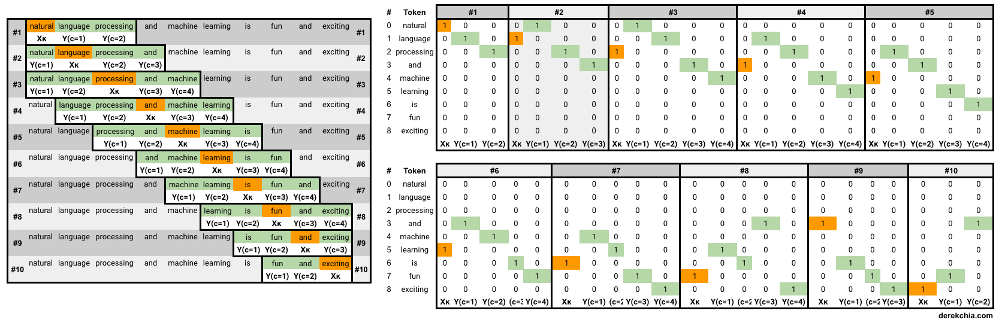

# Red neuronal aprende la semántica del rap hispano de forma no supervisada
Word2Vec es una red neuronal de dos capas para procesar texto. Lo convierte en vectores numéricos que otros modelos entienden, en los word embeddings se conserva la relación semántica entre palabras, rimas, sinónimos, antónimos, etc.

Esto se puede hacer con reviews, comentarios, libros, tweets, y en este caso canciones; con el vocabulario aprendido se puede aplicar sentiment analysis y otras tareas de NLP en la investigación, música, e-commerce, y CRM entre otros.

Haremos lo siguiente:
* Importar dataset
* Limpiar dataset
* Entrenar el modelo usando la implementación Gensim
* Exportar el modelo y los word embeddings


* Predecir contexto según palabra
* Predecir palabra según contexto
* Sumar y restar palabras
* Descartar palabra del grupo de palábras


* Visualizar modelo en 2D

El modelo se puede visualizar en 3D usando Tensorboard, pero dejaré eso para otro artículo, más info en https://stackoverflow.com/questions/50492676/visualize-gensim-word2vec-embeddings-in-tensorboard-projector/50499090

Las palabras son estados discretos de datos, y buscamos las probabilidades transicionales entre estos, analizando las palabras vecinas. De forma no supervisada encontramos patrones, guardamos la similaridad matemática de la semántica en vectores.




Suponiendo que tenemos un vocabulario de 10.000 palabras, por cada palabra crearemos un vector one-hot de 10.000 dimensiones, una por cada palabra, con un 1 donde esté la palabra y lo demás 0s.

El output es un vector también de 10.000 componentes, por cada palabra, la posibilidad de que otra palabra aleatoria aparezca cerca de esta. Arquitectura de la red neuronal:


[Ejemplo práctico](http://methodmatters.blogspot.com/2017/11/using-word2vec-to-analyze-word.html)

[El modelo explicado en detalle](http://mccormickml.com/2016/04/19/word2vec-tutorial-the-skip-gram-model/)

[Subsampling y otras técnicas para datasets grandes](http://mccormickml.com/2017/01/11/word2vec-tutorial-part-2-negative-sampling/)


## Dataset: 9317 letras de canciones rap hispanohablante
~24MB de texto, pese a ser un dataset pequeño se obtienen resultados significantes.

Cuidado con los falsos positivos, esto dependerá de la tarea NLP que queramos resolver con el modelo: encontrar sinónimos, antónimos, temáticas, etcétera.

Encontré la letra de las canciones en HHGroups.com, desde 2005 recolecta contenido del Hip Hop al estilo de una wiki.

En un futuro sería mejor usar un dataset limpio (aquí hay partes en inglés, francés y catalán), y con más canciones (faltan algunos álbumes y singles, el dataset podría ser el doble de grande).


```python
import pandas as pd
import unidecode
import string
import numpy as np
import matplotlib.pyplot as plt
import nltk
import re
from nltk.corpus import stopwords
from nltk.tokenize import sent_tokenize, word_tokenize
import gensim, logging
import gensim.models.word2vec as w2v
import multiprocessing
from sklearn.manifold import TSNE
```

Logging opcional, y descargamos las stopwords


```python
#logging.basicConfig(format='%(asctime)s : %(levelname)s : %(message)s', level=logging.INFO)
nltk.download("stopwords")
```

    [nltk_data] Downloading package stopwords to
    [nltk_data]     C:\Users\Samuel\AppData\Roaming\nltk_data...
    [nltk_data]   Package stopwords is already up-to-date!
    


    True


## Importar dataset
Cargamos el CSV, que contiene metadatos de todas las canciones.


```python
hhgroups = pd.read_csv('hhgroups_merge_28_05.csv', index_col='id')
hhgroups.head()
```


<div>
<style scoped>
    .dataframe tbody tr th:only-of-type {
        vertical-align: middle;
    }

    .dataframe tbody tr th {
        vertical-align: top;
    }

    .dataframe thead th {
        text-align: right;
    }
</style>
<table border="1" class="dataframe">
  <thead>
    <tr style="text-align: right;">
      <th></th>
      <th>artista</th>
      <th>cancion</th>
      <th>album</th>
      <th>letra</th>
      <th>anyo</th>
      <th>visitas</th>
    </tr>
    <tr>
      <th>id</th>
      <th></th>
      <th></th>
      <th></th>
      <th></th>
      <th></th>
      <th></th>
    </tr>
  </thead>
  <tbody>
    <tr>
      <th>0</th>
      <td>Denom</td>
      <td>Machete (con Jarfaiter y Gente jodida)</td>
      <td>Medicina</td>
      <td>Para su nuevo disco "Medicina", Denom ha vuelt...</td>
      <td>2019</td>
      <td>126</td>
    </tr>
    <tr>
      <th>1</th>
      <td>Denom</td>
      <td>Vacío (con Ivo Incuerdo)</td>
      <td>Medicina</td>
      <td>[Denom]\nYo que quería, yo que pedía vida,\nSe...</td>
      <td>2019</td>
      <td>361</td>
    </tr>
    <tr>
      <th>2</th>
      <td>Denom</td>
      <td>El orgullo es fiel (con Juancho Marqués y Elio...</td>
      <td>Medicina</td>
      <td>"El orgullo es fiel" es uno de los cortes incl...</td>
      <td>2019</td>
      <td>262</td>
    </tr>
    <tr>
      <th>3</th>
      <td>Denom</td>
      <td>Mueve mueve (con Fernandocosta)</td>
      <td>Medicina</td>
      <td>[Estribillo: Denom] (x2)\nMueve, mueve, mueve,...</td>
      <td>2019</td>
      <td>578</td>
    </tr>
    <tr>
      <th>4</th>
      <td>Jaro Desperdizio</td>
      <td>Insomnia</td>
      <td>Sin álbum, es un vídeo suelto</td>
      <td>[Estribillo]\nY en esta noche, ¿Quién me arrop...</td>
      <td>2019</td>
      <td>219</td>
    </tr>
  </tbody>
</table>
</div>


## Limpiar el dataset y crear corpus de texto
Sólo nos interesa la columna con las letras, por cada canción tendremos un array de palabras, y terminamos con un array de canciones (letras_limpio) que le pasaremos a Word2Vec. Eliminamos las stopwords y canciones vacías.

Adicionalmente, podríamos usar **stemming** para reducir la cantidad de palabras concretas y ayudar al modelo a generalizar.

También tengo pendiente probar parámetros de negative sampling. (http://mccormickml.com/2017/01/11/word2vec-tutorial-part-2-negative-sampling/)

El código se puede hacer mucho más eficiente con RegEx, [como en este ejemplo](http://methodmatters.blogspot.com/2017/11/using-word2vec-to-analyze-word.html). El problema es excluir los artistas de la nomenclatura de la letra, estilo [Artista]


```python
stop_words = set(stopwords.words('spanish') + stopwords.words('english') + ['x1','x2','x3', 'x4', 'x5', 'x6', 'x7', 'x8', '¡publicítate', 'HHGroups', '20€', 'estribillo'])
letras = list(hhgroups['letra'])
letras_limpio = []
extpunctuation = string.punctuation + '¡¿[]()'

# Eliminamos canciones sin letra
for letra in list(letras):
    if "¿Tienes ya la letra para este tema? Ayúdanos y ¡Envíanosla!" in letra:
        letras.remove(letra)

for i in range(len(letras)):
    cancion_limpia = []
    letra = letras[i].lower().split('\n')
    for linea in letra:
        #linea = bytes(linea, 'utf-8').decode('utf-8', 'ignore')
        if linea != '' and '[' not in linea:
            linea = "".join(c for c in linea if c not in extpunctuation)
            for palabra in linea.split(' '):
                if palabra not in stop_words:
                    cancion_limpia.append(palabra)
    letras_limpio.append(cancion_limpia)
```

Las primeras 16 palabras de la canción 1011 para ver como queda sin stopwords:


```python
letras_limpio[1011][:16]
```


    ['claro',
     'fácil',
     'poder',
     'perdonar',
     'olvidar',
     'cicatrices',
     'claro',
     'intento',
     'cosas',
     'jamás',
     'encajare',
     'hiciste',
     'hable',
     'mal',
     'travieso',
     'terco']


# Entrenar el modelo Word2Vec
A la hora de entrenar Word2Vec, hay dos arquitecturas:
* **Skip-gram**: funciona bien con datasets pequeños, representa bien palabras y frases poco frecuentes.
* **Continuous Bag of Words**: mucho más rápido de entrenar, más precisión con palabras muy frecuentes.
En algunos casos usaremos Skip-Gram y en otros CBOW dependiendo de los resultados.

Entrenaré ambos modelos para comparar resultados, aunque varian mucho entre dataset y parámetros que escogemos.

Parámetros:
* **letras**, el corpus de texto limpio
* **sg**, 1 para usar skip-gram, 0 para usar CBOW
* **seed**, no la cambio para tener resultados reproducibles y debugear
* **size**, el tamaño de los vectores de palabras. Recomendado 300 incluso con datasets grandes pero depende más de la complejidad del vocabulario. Usa múltiples de 2 para rendimiento.
* **min_count**, mínimo de veces que ha de aparecer cada palabra, para ser considerada. Si no se repite lo suficiente, no podremos sacar intuición semántica significativa.
* **window**, ventana contextual 4 palabras anteriores y 4 siguientes.

Más info en: http://methodmatters.blogspot.com/2017/11/using-word2vec-to-analyze-word.html


```python
model_sg = w2v.Word2Vec(
    letras_limpio,
    sg=1,
    seed=1,
    workers=multiprocessing.cpu_count(),
    size=300,
    min_count=20,
    window=7
)

model_cbow = w2v.Word2Vec(
    letras_limpio,
    sg=0,
    seed=1,
    workers=multiprocessing.cpu_count(),
    size=300,
    min_count=20,
    window=7
)
```

    2019-10-11 12:28:33,391 : INFO : collecting all words and their counts
    2019-10-11 12:28:33,391 : INFO : PROGRESS: at sentence #0, processed 0 words, keeping 0 word types
    2019-10-11 12:28:34,094 : INFO : collected 135930 word types from a corpus of 2231682 raw words and 9317 sentences
    2019-10-11 12:28:34,094 : INFO : Loading a fresh vocabulary
    2019-10-11 12:28:34,203 : INFO : effective_min_count=20 retains 12467 unique words (9% of original 135930, drops 123463)
    2019-10-11 12:28:34,203 : INFO : effective_min_count=20 leaves 1879621 word corpus (84% of original 2231682, drops 352061)
    2019-10-11 12:28:34,266 : INFO : deleting the raw counts dictionary of 135930 items
    2019-10-11 12:28:34,266 : INFO : sample=0.001 downsamples 25 most-common words
    2019-10-11 12:28:34,266 : INFO : downsampling leaves estimated 1809017 word corpus (96.2% of prior 1879621)
    2019-10-11 12:28:34,328 : INFO : estimated required memory for 12467 words and 300 dimensions: 36154300 bytes
    2019-10-11 12:28:34,328 : INFO : resetting layer weights
    2019-10-11 12:28:34,531 : INFO : training model with 4 workers on 12467 vocabulary and 300 features, using sg=1 hs=0 sample=0.001 negative=5 window=7
    2019-10-11 12:28:35,640 : INFO : EPOCH 1 - PROGRESS: at 5.91% examples, 97380 words/s, in_qsize 8, out_qsize 0
    2019-10-11 12:28:36,646 : INFO : EPOCH 1 - PROGRESS: at 12.80% examples, 112679 words/s, in_qsize 7, out_qsize 0
    2019-10-11 12:28:37,724 : INFO : EPOCH 1 - PROGRESS: at 21.90% examples, 129805 words/s, in_qsize 8, out_qsize 0
    2019-10-11 12:28:38,802 : INFO : EPOCH 1 - PROGRESS: at 29.74% examples, 133719 words/s, in_qsize 7, out_qsize 0
    2019-10-11 12:28:39,907 : INFO : EPOCH 1 - PROGRESS: at 37.05% examples, 135664 words/s, in_qsize 7, out_qsize 0
    2019-10-11 12:28:41,001 : INFO : EPOCH 1 - PROGRESS: at 44.51% examples, 135405 words/s, in_qsize 7, out_qsize 0
    2019-10-11 12:28:42,039 : INFO : EPOCH 1 - PROGRESS: at 53.99% examples, 137954 words/s, in_qsize 8, out_qsize 0
    2019-10-11 12:28:43,070 : INFO : EPOCH 1 - PROGRESS: at 63.20% examples, 138215 words/s, in_qsize 8, out_qsize 0
    2019-10-11 12:28:44,086 : INFO : EPOCH 1 - PROGRESS: at 71.87% examples, 138342 words/s, in_qsize 7, out_qsize 0
    2019-10-11 12:28:45,211 : INFO : EPOCH 1 - PROGRESS: at 82.54% examples, 140481 words/s, in_qsize 7, out_qsize 0
    2019-10-11 12:28:46,321 : INFO : EPOCH 1 - PROGRESS: at 90.43% examples, 138987 words/s, in_qsize 7, out_qsize 0
    2019-10-11 12:28:47,390 : INFO : EPOCH 1 - PROGRESS: at 96.88% examples, 136199 words/s, in_qsize 7, out_qsize 0
    2019-10-11 12:28:47,718 : INFO : worker thread finished; awaiting finish of 3 more threads
    2019-10-11 12:28:47,718 : INFO : worker thread finished; awaiting finish of 2 more threads
    2019-10-11 12:28:47,764 : INFO : worker thread finished; awaiting finish of 1 more threads
    2019-10-11 12:28:47,843 : INFO : worker thread finished; awaiting finish of 0 more threads
    2019-10-11 12:28:47,843 : INFO : EPOCH - 1 : training on 2231682 raw words (1808952 effective words) took 13.3s, 136012 effective words/s
    2019-10-11 12:28:48,889 : INFO : EPOCH 2 - PROGRESS: at 5.81% examples, 101958 words/s, in_qsize 7, out_qsize 0
    2019-10-11 12:28:49,967 : INFO : EPOCH 2 - PROGRESS: at 12.80% examples, 111582 words/s, in_qsize 7, out_qsize 0
    2019-10-11 12:28:51,107 : INFO : EPOCH 2 - PROGRESS: at 22.26% examples, 128911 words/s, in_qsize 8, out_qsize 0
    2019-10-11 12:28:52,210 : INFO : EPOCH 2 - PROGRESS: at 30.06% examples, 132570 words/s, in_qsize 7, out_qsize 0
    2019-10-11 12:28:53,225 : INFO : EPOCH 2 - PROGRESS: at 37.05% examples, 135378 words/s, in_qsize 7, out_qsize 0
    2019-10-11 12:28:54,272 : INFO : EPOCH 2 - PROGRESS: at 43.00% examples, 131062 words/s, in_qsize 7, out_qsize 0
    2019-10-11 12:28:55,280 : INFO : EPOCH 2 - PROGRESS: at 50.91% examples, 132680 words/s, in_qsize 7, out_qsize 0
    2019-10-11 12:28:56,311 : INFO : EPOCH 2 - PROGRESS: at 60.59% examples, 134570 words/s, in_qsize 8, out_qsize 0
    2019-10-11 12:28:57,332 : INFO : EPOCH 2 - PROGRESS: at 68.47% examples, 133460 words/s, in_qsize 8, out_qsize 0
    2019-10-11 12:28:58,441 : INFO : EPOCH 2 - PROGRESS: at 78.64% examples, 135223 words/s, in_qsize 8, out_qsize 0
    2019-10-11 12:28:59,456 : INFO : EPOCH 2 - PROGRESS: at 86.74% examples, 135368 words/s, in_qsize 7, out_qsize 0
    2019-10-11 12:29:00,506 : INFO : EPOCH 2 - PROGRESS: at 94.27% examples, 134438 words/s, in_qsize 7, out_qsize 0
    2019-10-11 12:29:01,068 : INFO : worker thread finished; awaiting finish of 3 more threads
    2019-10-11 12:29:01,115 : INFO : worker thread finished; awaiting finish of 2 more threads
    2019-10-11 12:29:01,131 : INFO : worker thread finished; awaiting finish of 1 more threads
    2019-10-11 12:29:01,225 : INFO : worker thread finished; awaiting finish of 0 more threads
    2019-10-11 12:29:01,225 : INFO : EPOCH - 2 : training on 2231682 raw words (1809286 effective words) took 13.4s, 135198 effective words/s
    2019-10-11 12:29:02,238 : INFO : EPOCH 3 - PROGRESS: at 5.42% examples, 97950 words/s, in_qsize 7, out_qsize 0
    2019-10-11 12:29:03,269 : INFO : EPOCH 3 - PROGRESS: at 9.87% examples, 88172 words/s, in_qsize 7, out_qsize 0
    2019-10-11 12:29:04,456 : INFO : EPOCH 3 - PROGRESS: at 17.80% examples, 103388 words/s, in_qsize 8, out_qsize 0
    2019-10-11 12:29:05,473 : INFO : EPOCH 3 - PROGRESS: at 24.32% examples, 108832 words/s, in_qsize 8, out_qsize 0
    2019-10-11 12:29:06,490 : INFO : EPOCH 3 - PROGRESS: at 31.60% examples, 115960 words/s, in_qsize 7, out_qsize 0
    2019-10-11 12:29:07,506 : INFO : EPOCH 3 - PROGRESS: at 38.99% examples, 121948 words/s, in_qsize 7, out_qsize 0
    2019-10-11 12:29:08,521 : INFO : EPOCH 3 - PROGRESS: at 46.85% examples, 126428 words/s, in_qsize 7, out_qsize 0
    2019-10-11 12:29:09,605 : INFO : EPOCH 3 - PROGRESS: at 55.58% examples, 126276 words/s, in_qsize 7, out_qsize 0
    2019-10-11 12:29:10,667 : INFO : EPOCH 3 - PROGRESS: at 65.10% examples, 128177 words/s, in_qsize 7, out_qsize 0
    2019-10-11 12:29:11,674 : INFO : EPOCH 3 - PROGRESS: at 75.28% examples, 131686 words/s, in_qsize 7, out_qsize 0
    2019-10-11 12:29:12,772 : INFO : EPOCH 3 - PROGRESS: at 83.90% examples, 131896 words/s, in_qsize 7, out_qsize 0
    2019-10-11 12:29:13,819 : INFO : EPOCH 3 - PROGRESS: at 92.86% examples, 133219 words/s, in_qsize 7, out_qsize 0
    2019-10-11 12:29:14,522 : INFO : worker thread finished; awaiting finish of 3 more threads
    2019-10-11 12:29:14,538 : INFO : worker thread finished; awaiting finish of 2 more threads
    2019-10-11 12:29:14,591 : INFO : worker thread finished; awaiting finish of 1 more threads
    2019-10-11 12:29:14,607 : INFO : worker thread finished; awaiting finish of 0 more threads
    2019-10-11 12:29:14,607 : INFO : EPOCH - 3 : training on 2231682 raw words (1809094 effective words) took 13.4s, 135231 effective words/s
    2019-10-11 12:29:15,669 : INFO : EPOCH 4 - PROGRESS: at 5.91% examples, 101771 words/s, in_qsize 7, out_qsize 0
    2019-10-11 12:29:16,719 : INFO : EPOCH 4 - PROGRESS: at 12.77% examples, 112879 words/s, in_qsize 7, out_qsize 0
    2019-10-11 12:29:17,875 : INFO : EPOCH 4 - PROGRESS: at 20.92% examples, 121926 words/s, in_qsize 7, out_qsize 0
    2019-10-11 12:29:18,883 : INFO : EPOCH 4 - PROGRESS: at 26.33% examples, 117501 words/s, in_qsize 7, out_qsize 0
    2019-10-11 12:29:19,888 : INFO : EPOCH 4 - PROGRESS: at 31.60% examples, 115776 words/s, in_qsize 7, out_qsize 0
    2019-10-11 12:29:21,013 : INFO : EPOCH 4 - PROGRESS: at 37.73% examples, 116089 words/s, in_qsize 8, out_qsize 0
    2019-10-11 12:29:22,043 : INFO : EPOCH 4 - PROGRESS: at 45.27% examples, 119763 words/s, in_qsize 7, out_qsize 0
    2019-10-11 12:29:23,121 : INFO : EPOCH 4 - PROGRESS: at 55.05% examples, 123496 words/s, in_qsize 8, out_qsize 0
    2019-10-11 12:29:24,152 : INFO : EPOCH 4 - PROGRESS: at 64.61% examples, 126044 words/s, in_qsize 7, out_qsize 0
    2019-10-11 12:29:25,279 : INFO : EPOCH 4 - PROGRESS: at 74.79% examples, 128345 words/s, in_qsize 8, out_qsize 0
    2019-10-11 12:29:26,295 : INFO : EPOCH 4 - PROGRESS: at 83.90% examples, 130359 words/s, in_qsize 7, out_qsize 0
    2019-10-11 12:29:27,357 : INFO : EPOCH 4 - PROGRESS: at 91.40% examples, 129704 words/s, in_qsize 7, out_qsize 0
    2019-10-11 12:29:28,310 : INFO : worker thread finished; awaiting finish of 3 more threads
    2019-10-11 12:29:28,372 : INFO : EPOCH 4 - PROGRESS: at 99.48% examples, 130802 words/s, in_qsize 2, out_qsize 1
    2019-10-11 12:29:28,372 : INFO : worker thread finished; awaiting finish of 2 more threads
    2019-10-11 12:29:28,388 : INFO : worker thread finished; awaiting finish of 1 more threads
    2019-10-11 12:29:28,419 : INFO : worker thread finished; awaiting finish of 0 more threads
    2019-10-11 12:29:28,419 : INFO : EPOCH - 4 : training on 2231682 raw words (1809034 effective words) took 13.8s, 131020 effective words/s
    2019-10-11 12:29:29,497 : INFO : EPOCH 5 - PROGRESS: at 7.68% examples, 130959 words/s, in_qsize 7, out_qsize 0
    2019-10-11 12:29:30,546 : INFO : EPOCH 5 - PROGRESS: at 14.34% examples, 128129 words/s, in_qsize 7, out_qsize 0
    2019-10-11 12:29:31,648 : INFO : EPOCH 5 - PROGRESS: at 22.69% examples, 133947 words/s, in_qsize 8, out_qsize 0
    2019-10-11 12:29:32,648 : INFO : EPOCH 5 - PROGRESS: at 30.84% examples, 141185 words/s, in_qsize 7, out_qsize 0
    2019-10-11 12:29:33,757 : INFO : EPOCH 5 - PROGRESS: at 37.05% examples, 137020 words/s, in_qsize 7, out_qsize 0
    2019-10-11 12:29:34,766 : INFO : EPOCH 5 - PROGRESS: at 42.17% examples, 130764 words/s, in_qsize 7, out_qsize 0
    2019-10-11 12:29:35,781 : INFO : EPOCH 5 - PROGRESS: at 46.85% examples, 125547 words/s, in_qsize 7, out_qsize 0
    2019-10-11 12:29:36,786 : INFO : EPOCH 5 - PROGRESS: at 55.05% examples, 125762 words/s, in_qsize 7, out_qsize 0
    2019-10-11 12:29:37,801 : INFO : EPOCH 5 - PROGRESS: at 62.71% examples, 125150 words/s, in_qsize 7, out_qsize 0
    2019-10-11 12:29:38,879 : INFO : EPOCH 5 - PROGRESS: at 72.44% examples, 127366 words/s, in_qsize 7, out_qsize 0
    2019-10-11 12:29:39,892 : INFO : EPOCH 5 - PROGRESS: at 81.18% examples, 128723 words/s, in_qsize 8, out_qsize 0
    2019-10-11 12:29:41,032 : INFO : EPOCH 5 - PROGRESS: at 89.47% examples, 128687 words/s, in_qsize 8, out_qsize 0
    2019-10-11 12:29:42,177 : INFO : EPOCH 5 - PROGRESS: at 98.64% examples, 129705 words/s, in_qsize 4, out_qsize 0
    2019-10-11 12:29:42,193 : INFO : worker thread finished; awaiting finish of 3 more threads
    2019-10-11 12:29:42,287 : INFO : worker thread finished; awaiting finish of 2 more threads
    2019-10-11 12:29:42,287 : INFO : worker thread finished; awaiting finish of 1 more threads
    2019-10-11 12:29:42,302 : INFO : worker thread finished; awaiting finish of 0 more threads
    2019-10-11 12:29:42,302 : INFO : EPOCH - 5 : training on 2231682 raw words (1808758 effective words) took 13.9s, 130532 effective words/s
    2019-10-11 12:29:42,302 : INFO : training on a 11158410 raw words (9045124 effective words) took 67.8s, 133476 effective words/s
    2019-10-11 12:29:42,318 : INFO : collecting all words and their counts
    2019-10-11 12:29:42,318 : INFO : PROGRESS: at sentence #0, processed 0 words, keeping 0 word types
    2019-10-11 12:29:42,958 : INFO : collected 135930 word types from a corpus of 2231682 raw words and 9317 sentences
    2019-10-11 12:29:42,958 : INFO : Loading a fresh vocabulary
    2019-10-11 12:29:43,052 : INFO : effective_min_count=20 retains 12467 unique words (9% of original 135930, drops 123463)
    2019-10-11 12:29:43,052 : INFO : effective_min_count=20 leaves 1879621 word corpus (84% of original 2231682, drops 352061)
    2019-10-11 12:29:43,115 : INFO : deleting the raw counts dictionary of 135930 items
    2019-10-11 12:29:43,130 : INFO : sample=0.001 downsamples 25 most-common words
    2019-10-11 12:29:43,130 : INFO : downsampling leaves estimated 1809017 word corpus (96.2% of prior 1879621)
    2019-10-11 12:29:43,193 : INFO : estimated required memory for 12467 words and 300 dimensions: 36154300 bytes
    2019-10-11 12:29:43,193 : INFO : resetting layer weights
    2019-10-11 12:29:43,458 : INFO : training model with 4 workers on 12467 vocabulary and 300 features, using sg=0 hs=0 sample=0.001 negative=5 window=7
    2019-10-11 12:29:44,474 : INFO : EPOCH 1 - PROGRESS: at 34.54% examples, 672541 words/s, in_qsize 7, out_qsize 0
    2019-10-11 12:29:45,486 : INFO : EPOCH 1 - PROGRESS: at 69.52% examples, 637743 words/s, in_qsize 8, out_qsize 0
    2019-10-11 12:29:46,298 : INFO : worker thread finished; awaiting finish of 3 more threads
    2019-10-11 12:29:46,298 : INFO : worker thread finished; awaiting finish of 2 more threads
    2019-10-11 12:29:46,314 : INFO : worker thread finished; awaiting finish of 1 more threads
    2019-10-11 12:29:46,314 : INFO : worker thread finished; awaiting finish of 0 more threads
    2019-10-11 12:29:46,330 : INFO : EPOCH - 1 : training on 2231682 raw words (1809091 effective words) took 2.9s, 634034 effective words/s
    2019-10-11 12:29:47,328 : INFO : EPOCH 2 - PROGRESS: at 32.94% examples, 640756 words/s, in_qsize 7, out_qsize 0
    2019-10-11 12:29:48,343 : INFO : EPOCH 2 - PROGRESS: at 62.14% examples, 578344 words/s, in_qsize 7, out_qsize 0
    2019-10-11 12:29:49,343 : INFO : EPOCH 2 - PROGRESS: at 97.31% examples, 583746 words/s, in_qsize 7, out_qsize 0
    2019-10-11 12:29:49,405 : INFO : worker thread finished; awaiting finish of 3 more threads
    2019-10-11 12:29:49,452 : INFO : worker thread finished; awaiting finish of 2 more threads
    2019-10-11 12:29:49,468 : INFO : worker thread finished; awaiting finish of 1 more threads
    2019-10-11 12:29:49,483 : INFO : worker thread finished; awaiting finish of 0 more threads
    2019-10-11 12:29:49,483 : INFO : EPOCH - 2 : training on 2231682 raw words (1809286 effective words) took 3.2s, 573749 effective words/s
    2019-10-11 12:29:50,549 : INFO : EPOCH 3 - PROGRESS: at 25.94% examples, 477933 words/s, in_qsize 7, out_qsize 0
    2019-10-11 12:29:51,550 : INFO : EPOCH 3 - PROGRESS: at 47.30% examples, 457210 words/s, in_qsize 7, out_qsize 0
    2019-10-11 12:29:52,565 : INFO : EPOCH 3 - PROGRESS: at 82.07% examples, 489399 words/s, in_qsize 7, out_qsize 0
    2019-10-11 12:29:53,065 : INFO : worker thread finished; awaiting finish of 3 more threads
    2019-10-11 12:29:53,065 : INFO : worker thread finished; awaiting finish of 2 more threads
    2019-10-11 12:29:53,081 : INFO : worker thread finished; awaiting finish of 1 more threads
    2019-10-11 12:29:53,081 : INFO : worker thread finished; awaiting finish of 0 more threads
    2019-10-11 12:29:53,081 : INFO : EPOCH - 3 : training on 2231682 raw words (1809028 effective words) took 3.6s, 506712 effective words/s
    2019-10-11 12:29:54,100 : INFO : EPOCH 4 - PROGRESS: at 28.61% examples, 544849 words/s, in_qsize 7, out_qsize 0
    2019-10-11 12:29:55,099 : INFO : EPOCH 4 - PROGRESS: at 61.12% examples, 571653 words/s, in_qsize 7, out_qsize 0
    2019-10-11 12:29:56,099 : INFO : EPOCH 4 - PROGRESS: at 95.58% examples, 573965 words/s, in_qsize 8, out_qsize 0
    2019-10-11 12:29:56,208 : INFO : worker thread finished; awaiting finish of 3 more threads
    2019-10-11 12:29:56,208 : INFO : worker thread finished; awaiting finish of 2 more threads
    2019-10-11 12:29:56,224 : INFO : worker thread finished; awaiting finish of 1 more threads
    2019-10-11 12:29:56,240 : INFO : worker thread finished; awaiting finish of 0 more threads
    2019-10-11 12:29:56,240 : INFO : EPOCH - 4 : training on 2231682 raw words (1808985 effective words) took 3.1s, 574820 effective words/s
    2019-10-11 12:29:57,269 : INFO : EPOCH 5 - PROGRESS: at 27.08% examples, 505219 words/s, in_qsize 8, out_qsize 0
    2019-10-11 12:29:58,285 : INFO : EPOCH 5 - PROGRESS: at 53.99% examples, 508635 words/s, in_qsize 8, out_qsize 0
    2019-10-11 12:29:59,285 : INFO : EPOCH 5 - PROGRESS: at 94.75% examples, 562950 words/s, in_qsize 8, out_qsize 0
    2019-10-11 12:29:59,472 : INFO : worker thread finished; awaiting finish of 3 more threads
    2019-10-11 12:29:59,472 : INFO : worker thread finished; awaiting finish of 2 more threads
    2019-10-11 12:29:59,488 : INFO : worker thread finished; awaiting finish of 1 more threads
    2019-10-11 12:29:59,503 : INFO : worker thread finished; awaiting finish of 0 more threads
    2019-10-11 12:29:59,503 : INFO : EPOCH - 5 : training on 2231682 raw words (1808963 effective words) took 3.3s, 554049 effective words/s
    2019-10-11 12:29:59,519 : INFO : training on a 11158410 raw words (9045353 effective words) took 16.1s, 563563 effective words/s
    

Una vez se terminan de entrenar guardamos los word embeddings de cada modelo en archivos w2v.


```python
model_sg.save("model_sg.w2v")
model_cbow.save("model_cbow.w2v")
```

    2019-10-11 12:29:59,534 : INFO : saving Word2Vec object under model_sg.w2v, separately None
    2019-10-11 12:29:59,534 : INFO : not storing attribute vectors_norm
    2019-10-11 12:29:59,534 : INFO : not storing attribute cum_table
    2019-10-11 12:29:59,944 : INFO : saved model_sg.w2v
    2019-10-11 12:29:59,960 : INFO : saving Word2Vec object under model_cbow.w2v, separately None
    2019-10-11 12:29:59,960 : INFO : not storing attribute vectors_norm
    2019-10-11 12:29:59,960 : INFO : not storing attribute cum_table
    2019-10-11 12:30:00,335 : INFO : saved model_cbow.w2v
    

## Comprobar qué ha aprendido el modelo
### Predecir contexto según palabra
Con el modelo Skip-Gram obtenemos los mejores resultados, si ponemos españa nos salen otros países.


```python
model_sg.wv.most_similar("españa")
```


    [('país', 0.5987352132797241),
     ('méxico', 0.5855501890182495),
     ('español', 0.5838986039161682),
     ('europa', 0.577454686164856),
     ('chile', 0.5771331787109375),
     ('galicia', 0.5694625973701477),
     ('colombia', 0.5680597424507141),
     ('república', 0.5551925301551819),
     ('venezuela', 0.5540894269943237),
     ('francia', 0.543826699256897)]


En cambio, con el modelo CBOW, nos aparecen adjetivos y nombres relacionados con españa.


```python
model_cbow.wv.most_similar("españa")
```


    [('país', 0.8395527601242065),
     ('representa', 0.8235944509506226),
     ('industria', 0.8009352684020996),
     ('basura', 0.7745423913002014),
     ('negocio', 0.7568252682685852),
     ('nacional', 0.7530320882797241),
     ('feria', 0.747226357460022),
     ('política', 0.7459957599639893),
     ('respeta', 0.7422958612442017),
     ('presidente', 0.7356330752372742)]


### Analogías/Aforismos
Como las palabras son vectores, podemos mirar la distancia entre dos palabras, para que, dada una tercera palabra nos adivine la cuarta palabra, a la misma distancia que la 1ra y 2nda, de la 3ra.

He obtenido los mejores resultados con el modelo Skip-Gram, conserva los tiempos verbales a la vez que el contexto:


```python
def nearest_similarity_cosmul(start1, end1, end2, model):
    similarities = model.wv.most_similar_cosmul(
        positive=[end2, start1],
        negative=[end1]
    )
    start2 = similarities[0][0]
    print("{0} es a {1}, lo que  [{2}] es a {3}.".format(start1, end1, start2, end2))
```


```python
nearest_similarity_cosmul("amar", "amor", "odio", model_sg)
nearest_similarity_cosmul("caminar", "calle", "mar", model_sg)
```

    amar es a amor, lo que  [odiar] es a odio.
    caminar es a calle, lo que  [naufragar] es a mar.
    

Pero CBOW tambien pilla algunos conceptos opuestos:


```python
nearest_similarity_cosmul("amor", "odio", "día", model_cbow)
```

    amor es a odio, lo que  [noche] es a día.
    

### Descartar palabras fuera de semántica


```python
model_cbow.wv.doesnt_match("felicidad amor alegría envidia".split(" "))
```

    C:\Users\Samuel\Anaconda3\lib\site-packages\gensim\models\keyedvectors.py:877: FutureWarning: arrays to stack must be passed as a "sequence" type such as list or tuple. Support for non-sequence iterables such as generators is deprecated as of NumPy 1.16 and will raise an error in the future.
      vectors = vstack(self.word_vec(word, use_norm=True) for word in used_words).astype(REAL)
    


    'envidia'


### Sumar y restar palabras


```python
model_sg.most_similar(positive=['mujer', 'rey'], negative=['hombre'])[0]
```

    C:\Users\Samuel\Anaconda3\lib\site-packages\ipykernel_launcher.py:1: DeprecationWarning: Call to deprecated `most_similar` (Method will be removed in 4.0.0, use self.wv.most_similar() instead).
      """Entry point for launching an IPython kernel.
    


    ('reina', 0.44420093297958374)


Ejemplo: https://www.tensorflow.org/images/linear-relationships.png

## Visualizando el modelo en 2D con T-SNE (Skip-Gram)


```python
def tsne_plot(model):
    labels = []
    tokens = []

    for word in model.wv.vocab:
        tokens.append(model[word])
        labels.append(word)
    
    tsne_model = TSNE(perplexity=40, n_components=2, init='pca', n_iter=2500)
    new_values = tsne_model.fit_transform(tokens)

    x = []
    y = []
    for value in new_values:
        x.append(value[0])
        y.append(value[1])
        
    plt.figure(figsize=(64, 64)) 
    for i in range(len(x)):
        plt.scatter(x[i],y[i])
        plt.annotate(labels[i],
                     xy=(x[i], y[i]),
                     xytext=(5, 2),
                     textcoords='offset points',
                     ha='right',
                     va='bottom')
    plt.show()
```


```python
tsne_plot(model_sg)
```

    C:\Users\Samuel\Anaconda3\lib\site-packages\ipykernel_launcher.py:6: DeprecationWarning: Call to deprecated `__getitem__` (Method will be removed in 4.0.0, use self.wv.__getitem__() instead).
      
    C:\Users\Samuel\Anaconda3\lib\site-packages\matplotlib\backends\backend_agg.py:211: RuntimeWarning: Glyph 150 missing from current font.
      font.set_text(s, 0.0, flags=flags)
    C:\Users\Samuel\Anaconda3\lib\site-packages\matplotlib\backends\backend_agg.py:176: RuntimeWarning: Glyph 150 missing from current font.
      font.load_char(ord(s), flags=flags)
    C:\Users\Samuel\Anaconda3\lib\site-packages\matplotlib\backends\backend_agg.py:211: RuntimeWarning: Glyph 146 missing from current font.
      font.set_text(s, 0.0, flags=flags)
    C:\Users\Samuel\Anaconda3\lib\site-packages\matplotlib\backends\backend_agg.py:180: RuntimeWarning: Glyph 146 missing from current font.
      font.set_text(s, 0, flags=flags)
    C:\Users\Samuel\Anaconda3\lib\site-packages\matplotlib\backends\backend_agg.py:211: RuntimeWarning: Glyph 147 missing from current font.
      font.set_text(s, 0.0, flags=flags)
    C:\Users\Samuel\Anaconda3\lib\site-packages\matplotlib\backends\backend_agg.py:180: RuntimeWarning: Glyph 147 missing from current font.
      font.set_text(s, 0, flags=flags)
    C:\Users\Samuel\Anaconda3\lib\site-packages\matplotlib\backends\backend_agg.py:211: RuntimeWarning: Glyph 133 missing from current font.
      font.set_text(s, 0.0, flags=flags)
    C:\Users\Samuel\Anaconda3\lib\site-packages\matplotlib\backends\backend_agg.py:176: RuntimeWarning: Glyph 133 missing from current font.
      font.load_char(ord(s), flags=flags)
    C:\Users\Samuel\Anaconda3\lib\site-packages\matplotlib\backends\backend_agg.py:180: RuntimeWarning: Glyph 133 missing from current font.
      font.set_text(s, 0, flags=flags)
    


## Visualizando el modelo en 2D con T-SNE (CBOW)


```python
tsne_plot(model_cbow)
```

    C:\Users\Samuel\Anaconda3\lib\site-packages\ipykernel_launcher.py:6: DeprecationWarning: Call to deprecated `__getitem__` (Method will be removed in 4.0.0, use self.wv.__getitem__() instead).
      
    C:\Users\Samuel\Anaconda3\lib\site-packages\matplotlib\backends\backend_agg.py:211: RuntimeWarning: Glyph 150 missing from current font.
      font.set_text(s, 0.0, flags=flags)
    C:\Users\Samuel\Anaconda3\lib\site-packages\matplotlib\backends\backend_agg.py:176: RuntimeWarning: Glyph 150 missing from current font.
      font.load_char(ord(s), flags=flags)
    C:\Users\Samuel\Anaconda3\lib\site-packages\matplotlib\backends\backend_agg.py:211: RuntimeWarning: Glyph 146 missing from current font.
      font.set_text(s, 0.0, flags=flags)
    C:\Users\Samuel\Anaconda3\lib\site-packages\matplotlib\backends\backend_agg.py:180: RuntimeWarning: Glyph 146 missing from current font.
      font.set_text(s, 0, flags=flags)
    C:\Users\Samuel\Anaconda3\lib\site-packages\matplotlib\backends\backend_agg.py:211: RuntimeWarning: Glyph 147 missing from current font.
      font.set_text(s, 0.0, flags=flags)
    C:\Users\Samuel\Anaconda3\lib\site-packages\matplotlib\backends\backend_agg.py:180: RuntimeWarning: Glyph 147 missing from current font.
      font.set_text(s, 0, flags=flags)
    C:\Users\Samuel\Anaconda3\lib\site-packages\matplotlib\backends\backend_agg.py:211: RuntimeWarning: Glyph 133 missing from current font.
      font.set_text(s, 0.0, flags=flags)
    C:\Users\Samuel\Anaconda3\lib\site-packages\matplotlib\backends\backend_agg.py:176: RuntimeWarning: Glyph 133 missing from current font.
      font.load_char(ord(s), flags=flags)
    C:\Users\Samuel\Anaconda3\lib\site-packages\matplotlib\backends\backend_agg.py:180: RuntimeWarning: Glyph 133 missing from current font.
      font.set_text(s, 0, flags=flags)
    


